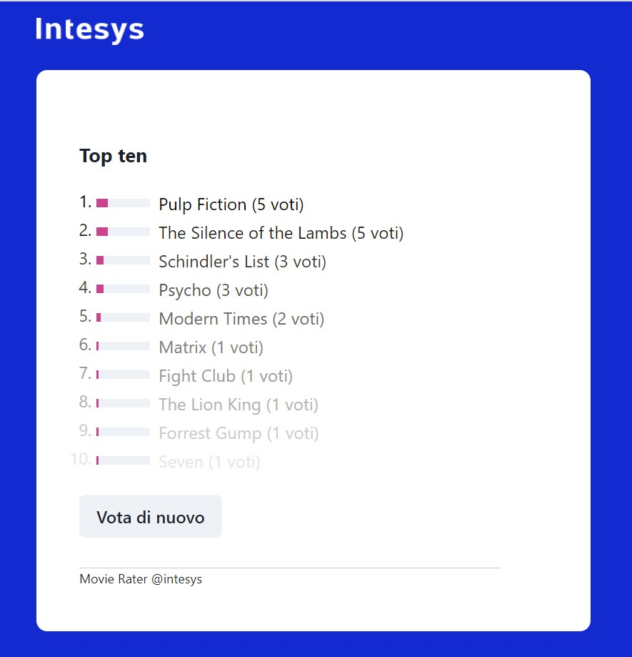
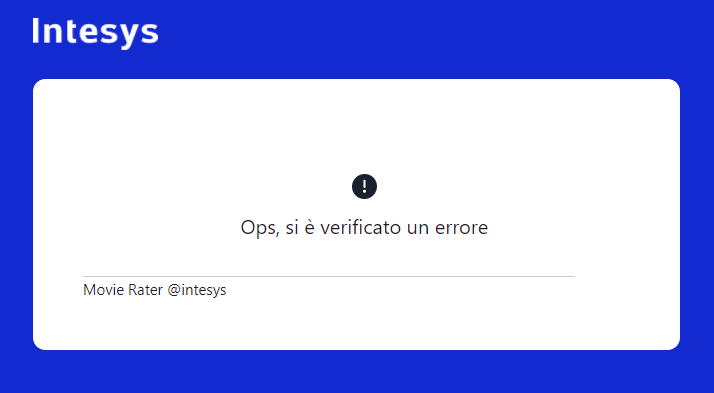
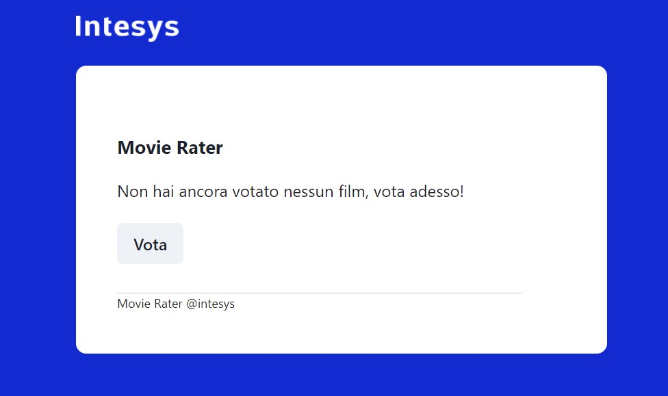
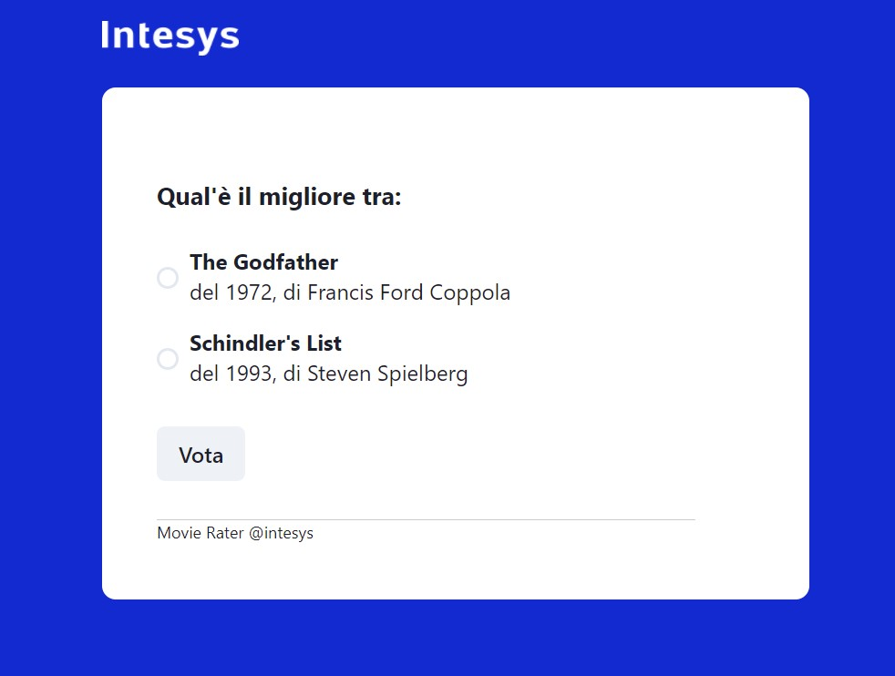
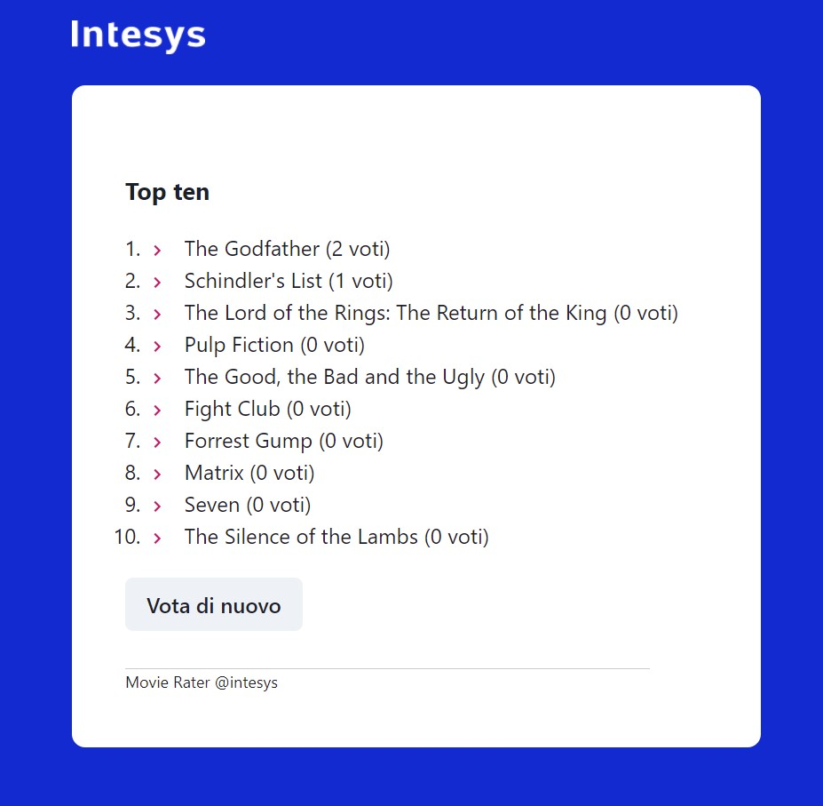

# Movie Rater - Frontend test - react

Movie Rater è un'applicazione web che mostra ai visitatori 2 film scelti in modo casuale e permette loro di scegliere
il preferito tra i 2.

Ogni volta che un utente vota uno dei 2 film l'applicazione aggiorna il contatore dei voti per il singolo film e mostra la classifica, infine propone altri 2 film sempre scelti in maniera casuale.

## Requirements

- node > 14
- npm

## Develop

Estrai i file dallo zip che ti abbiamo fornito.

Inizializza un repository git:

```
git init
git add .
git commit -m "initial"
```

Installa le dipendenze:

```
npm install
```

Avvia l'ambiente di sviluppo:

```
npm start
```

Apri il browser all'indirizzo:

```
http://localhost:1234
```

### Librerie utilizzate

L'applicazione è realizzata utilizzando le seguenti librerie:

- [typescript](https://www.typescriptlang.org/)
- [react](https://it.reactjs.org/)
- [parcel: bundler](https://parceljs.org/)
- [chackra: UI kit](https://chakra-ui.com/)
- [axios: HTTP library](https://axios-http.com/docs/intro)
- [msw: mock server](https://mswjs.io/)

Puoi consultare la documentazione sui rispettivi siti.

## Task assegnati

Esegui i seguenti task:

1. `src\lib\globalState\selectors\useAllMovies.ts` - completa: la funzione deve restituire un array di `movie` contenenti anche la proprietà `votes` (vedi interfaccia `IRatedMovie`)
2. `src\lib\globalState\selectors\useRandomMovies.ts` - completa: la funzione deve restituire solo due `movie` a caso
3. `src\lib\globalState\selectors\useTopTenMovies.ts` - completa: la funzione deve restituire solo i primi 10 `movie` ordinati per `votes`
4. `src\components\vote\Vote.tsx` - fix: non deve essere possibile votare, senza prima aver selezionato un `movie`
5. Correggi i warning che appaiono nella console del browser
6. Nella schermata "TopTen", realizza la grafica proposta di seguito (tip: utilizza il componente Chackra ["Progress"](https://chakra-ui.com/docs/feedback/progress)):<br/>
   
7. Simula un errore server side sull'api `GET /movies` e implementa la gestione dell'errore in modo che venga visualizzata la seguente schermata (tip: utilizza l'icona ["WarningIcon"](https://chakra-ui.com/docs/media-and-icons/icon) di Chackra):<br/>
   

> Suggerimento: nel codice trovi dei commenti `TODO` per aiutarti a svolgere i task.  
> Se riscontri delle difficoltà o non comprendi lo scopo dei task, contatta il tuo referente tecnico di intesys.

## Elaborato finale

Quando hai terminato il lavoro, fai uno zip contenente il codice del progetto. Attenzione, nello zip:

- **includi** la directory `.git`, per fare in modo che la commit history sia visibile, così sarà più semplice revisionare il tuo lavoro
- **escludi** le directory `node_modules`, `.dist`, `.parcel-cache` (cfr .gitignore).

Infine, invia lo zip alla persona di riferimento di intesys.

### Interfaccia

Al completamento dei task, l'interfaccia appare come di seguito:

<br/>
<br/>
<br/>

## Termini di valutazione

Valuteremo il tuo codice in base a questi parametri:

- il codice deve essere funzionante
- numero di task completati
- qualità dell'implementazione delle funzioni richieste
- ordine, concisione e chiarezza del codice e dei commenti
- tempo di svolgimento

Verrà valutata positivamente la presenza di test automatici (non è stata volutamente inserita nessuna libreria di test, il candidato può installare e utilizzare quella che preferisce).

## Note

Per rendere il processo di selezione equo per tutti si prega di non condividere con nessuno questo assignment o la soluzione proposta.
